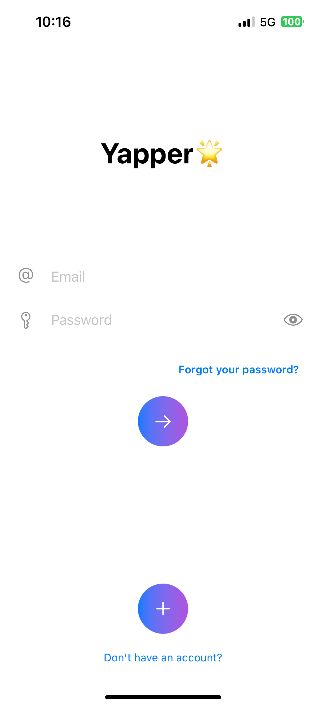
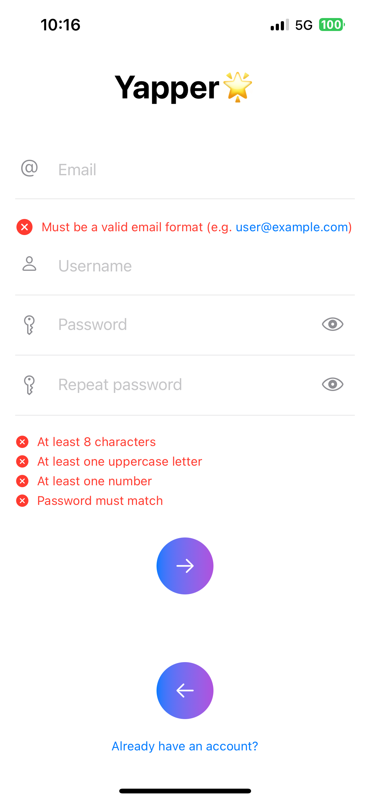
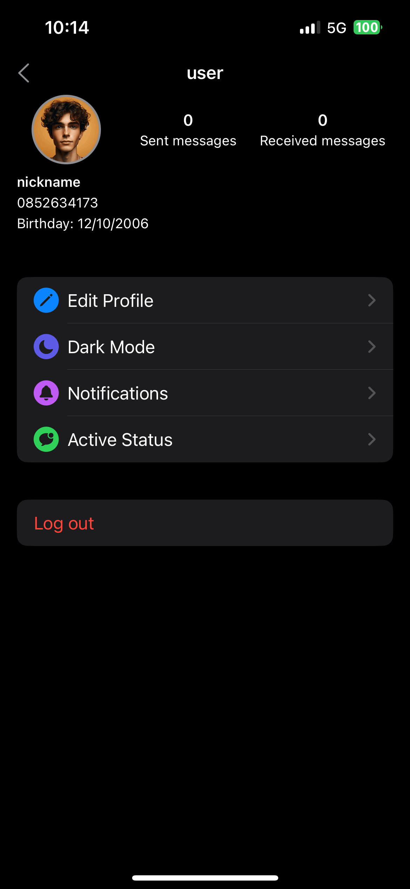
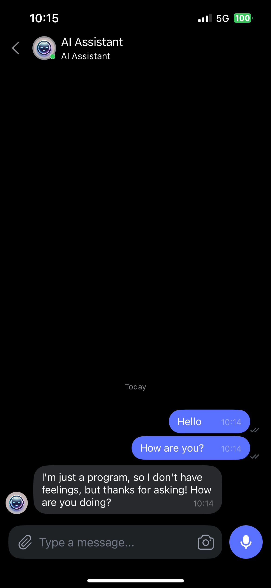
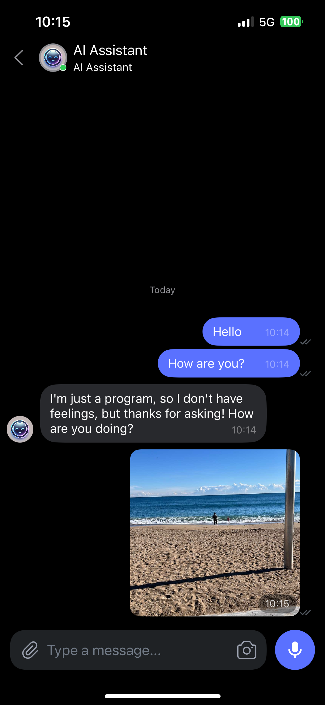

#  Chat-App

A real-time chat application for iOS built with SwiftUI and Firebase.

---

## 🚀 Features
- Real-time messaging  
- User authentication (Sign up, Login, Logout)  
- Profile customization  
- Media sharing (Images, Videos)  
- Search for messages  
- Have a chatBot conversation  

---

## 📸 Example Images

  
  
  
  
  
  
  
  
  

## 🔧 Installation

### ** Clone the Repository**
    
    git clone https://github.com/Mihael-M/Chat-App.git
    
   SwiftUI Package Manager
   
    dependencies: [
    .package(url: "https://github.com/exyte/Chat.git")]
    
    
   Install Dependencies via Swift Package Manager (SPM)
   
    1.    Open Xcode.
    
    2.    Navigate to File → Add Packages.
    
    3.    In the dialog that appears, enter the following Firebase Swift Package Manager URL:
    
    
    https://github.com/firebase/firebase-ios-sd

## Tech Stack

    •    Frontend: SwiftUI
    •    Backend: Firebase (Firestore, Authentication, Cloud Storage)
    •    Exyte / Chat
    •    Exyte / OpenAi

## Requirements

iOS 18+

Xcode 14+

